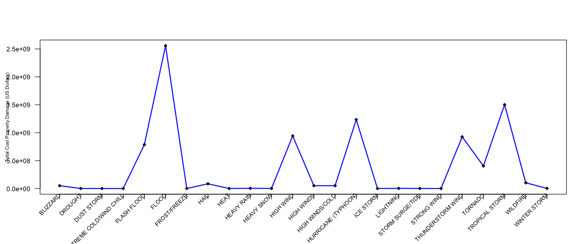

# Reproducible Research - Peer Assessment 2
Kevin E. D'Elia  
09/18/2015  


# Analysis of NOAA Storm Database
Access, data-wrangle, and provide data visualization of key variables contained in the NOAA Storm Database.


# Synopsis of Analysis
The basic goal of this assignment is to explore the NOAA Storm Database and answer some basic questions about severe weather events. [NEED MORE WORDS HERE!!!]

Storms and other severe weather events can cause both public health and economic problems for communities and municipalities. Many severe events can result in fatalities, injuries, and property damage, and preventing such outcomes to the extent possible is a key concern.

This project involves exploring the U.S. National Oceanic and Atmospheric Administration's (NOAA) storm database. This database tracks characteristics of major storms and weather events in the United States, including when and where they occur, as well as estimates of any fatalities, injuries, and property damage.
Data


# Data Processing

The data for this assignment come in the form of a comma-separated-value file compressed via the bzip2 algorithm to reduce its size. You can download the file from this link:
[Storm Data](https://d396qusza40orc.cloudfront.net/repdata%2Fdata%2FStormData.csv.bz2)

There is also some documentation of the database available. Here you will find how some of the variables are constructed/defined.

[National Weather Service Storm Data Documentation](https://d396qusza40orc.cloudfront.net/repdata%2Fpeer2_doc%2Fpd01016005curr.pdf)

[National Climatic Data Center Storm Events FAQ](https://d396qusza40orc.cloudfront.net/repdata%2Fpeer2_doc%2FNCDC%20Storm%20Events-FAQ%20Page.pdf)

The events in the database start in the year 1950 and end in November 2011. In the earlier years of the database there are generally fewer events recorded, most likely due to a lack of good records. More recent years should be considered more complete.

Once the data file has been downloaded, it can be loaded into **R** using the following function call:


```r
stormData <- read.csv(bzfile("./data/repdata_data_StormData.csv.bz2"), stringsAsFactors = FALSE)
```

A quick display of the dataframe's variables will help in subsequent selection and filtering approaches:


```r
str(stormData)
```

```
## 'data.frame':	902297 obs. of  37 variables:
##  $ STATE__   : num  1 1 1 1 1 1 1 1 1 1 ...
##  $ BGN_DATE  : chr  "4/18/1950 0:00:00" "4/18/1950 0:00:00" "2/20/1951 0:00:00" "6/8/1951 0:00:00" ...
##  $ BGN_TIME  : chr  "0130" "0145" "1600" "0900" ...
##  $ TIME_ZONE : chr  "CST" "CST" "CST" "CST" ...
##  $ COUNTY    : num  97 3 57 89 43 77 9 123 125 57 ...
##  $ COUNTYNAME: chr  "MOBILE" "BALDWIN" "FAYETTE" "MADISON" ...
##  $ STATE     : chr  "AL" "AL" "AL" "AL" ...
##  $ EVTYPE    : chr  "TORNADO" "TORNADO" "TORNADO" "TORNADO" ...
##  $ BGN_RANGE : num  0 0 0 0 0 0 0 0 0 0 ...
##  $ BGN_AZI   : chr  "" "" "" "" ...
##  $ BGN_LOCATI: chr  "" "" "" "" ...
##  $ END_DATE  : chr  "" "" "" "" ...
##  $ END_TIME  : chr  "" "" "" "" ...
##  $ COUNTY_END: num  0 0 0 0 0 0 0 0 0 0 ...
##  $ COUNTYENDN: logi  NA NA NA NA NA NA ...
##  $ END_RANGE : num  0 0 0 0 0 0 0 0 0 0 ...
##  $ END_AZI   : chr  "" "" "" "" ...
##  $ END_LOCATI: chr  "" "" "" "" ...
##  $ LENGTH    : num  14 2 0.1 0 0 1.5 1.5 0 3.3 2.3 ...
##  $ WIDTH     : num  100 150 123 100 150 177 33 33 100 100 ...
##  $ F         : int  3 2 2 2 2 2 2 1 3 3 ...
##  $ MAG       : num  0 0 0 0 0 0 0 0 0 0 ...
##  $ FATALITIES: num  0 0 0 0 0 0 0 0 1 0 ...
##  $ INJURIES  : num  15 0 2 2 2 6 1 0 14 0 ...
##  $ PROPDMG   : num  25 2.5 25 2.5 2.5 2.5 2.5 2.5 25 25 ...
##  $ PROPDMGEXP: chr  "K" "K" "K" "K" ...
##  $ CROPDMG   : num  0 0 0 0 0 0 0 0 0 0 ...
##  $ CROPDMGEXP: chr  "" "" "" "" ...
##  $ WFO       : chr  "" "" "" "" ...
##  $ STATEOFFIC: chr  "" "" "" "" ...
##  $ ZONENAMES : chr  "" "" "" "" ...
##  $ LATITUDE  : num  3040 3042 3340 3458 3412 ...
##  $ LONGITUDE : num  8812 8755 8742 8626 8642 ...
##  $ LATITUDE_E: num  3051 0 0 0 0 ...
##  $ LONGITUDE_: num  8806 0 0 0 0 ...
##  $ REMARKS   : chr  "" "" "" "" ...
##  $ REFNUM    : num  1 2 3 4 5 6 7 8 9 10 ...
```

There are 37 variables in this dataset, and only a small subset of those are needed for this analysis.  So, load the `dplyr` package in order to use its elegant selection and filtering capabilities.


```r
suppressMessages(library(dplyr))
library("dplyr")
```

The goal of this assignment is to answer the following questions:

1. Across the United States, which types of events (as indicated in the `EVTYPE` variable) are most harmful with respect to population health?
2. Across the United States, which types of events have the greatest economic consequences?

So, for the public health question, the **FATALITIES** and **INJURIES** columns would be of significance and for the economic question, the **PROPDMG**, **PROPDMGEXP**, **CROPDMG**, and **CROPDMGEXP** columns will contain useful information.  Naturally, the **EVTYPE** will be included, since it is the categorical value of primary concern.


```r
stormData  <- stormData  %>% select(c(EVTYPE, FATALITIES, INJURIES, PROPDMG, PROPDMGEXP, CROPDMG, CROPDMGEXP))
```

There are 902297 rows in the original dataset and, again, not all of those are needed, since some cells may contain values not useful in the analysis.  Furthermore, we can massage the data into dataframes that are more focused on the questions we'd like to answer, so we can select from our first subset only those columns relevant to each of our two questions and put them in separate dataframes.  Finally, for the population health question, since we are interested in events that caused fatalities and injuries only, let's filter out ones that didn't cause any:


```r
populationData <-   stormData  %>% 
                    select(c(EVTYPE, FATALITIES, INJURIES)) %>% 
                    filter(FATALITIES > 0.00 & INJURIES > 0.00)
```

Repeat the process, this time for the economic question.  We need only those columns related to property and crop damage; the exponent column is a multiplier which will come into play later on in the analysis.  For events that didn't cause any property or crop damage, exclude them:


```r
economicData <-   stormData  %>% 
                  select(c(EVTYPE, PROPDMG, PROPDMGEXP, CROPDMG, CROPDMGEXP)) %>% 
                  filter(PROPDMG > 0.00 & CROPDMG > 0.00)
```

This leaves 2649 rows for the dataset used to answer the population question and 16242 rows to answer the economic question, a significant reduction from the 902297 rows of the original dataset.  But, can the datasets be reduced even further?  If we run `summary` against columns of interest in each dataset, we may get some guidance.


```r
summary(populationData$FATALITIES)
```

```
##    Min. 1st Qu.  Median    Mean 3rd Qu.    Max. 
##   1.000   1.000   1.000   2.862   2.000 158.000
```

```r
summary(populationData$INJURIES)
```

```
##    Min. 1st Qu.  Median    Mean 3rd Qu.    Max. 
##    1.00    2.00    5.00   29.82   20.00 1700.00
```

Looking at these results, the significant values appear in the 3rd quartile.  Using that information, let's filter the population dataset down a bit more:


```r
populationData  <- populationData  %>% filter(FATALITIES >= 2 & INJURIES >= 20)
```

Appying the same approach to the economic data, we have the following summary information:


```r
summary(economicData$PROPDMG)
```

```
##    Min. 1st Qu.  Median    Mean 3rd Qu.    Max. 
##    0.01    5.00   15.00   66.23   50.00  975.00
```

```r
summary(economicData$CROPDMG)
```

```
##    Min. 1st Qu.  Median    Mean 3rd Qu.    Max. 
##    0.01    5.00   10.00   64.76   50.00  978.00
```

Again, it appears that the dataset can be further reduced by using the values for the 3rd quartile, and so we apply that filter now:


```r
economicData  <- economicData  %>% filter(PROPDMG >= 50 & CROPDMG >= 50)
```

The next step in the processing is to reverse-map the 48 Event Types defined by the National Weather Service (NWS) to the entries in our datasets.  The complete list can be found in the link to the National Weather Service Storm Data Documentation given above.  Some of the existing `EVTYPE` values are 1::1 with the NWS types but for those which are not, the following process will normalize them.  First, for the population data:

**Note**: This [link](http://forecast.weather.gov/glossary.php?word=tstm) will give the definition for **TSTM**, i.e., thunderstorm, as justification for changing any `EVTYPE` entries with that value to one of Thunderstorm.


```r
cold  <- grepl("cold", populationData$EVTYPE, ignore.case = T)
populationData$EVTYPE[cold]  <- "Cold/Wind Chill"

rain  <- grepl("rain", populationData$EVTYPE, ignore.case = T)
populationData$EVTYPE[rain]  <- "Heavy Rain"

fog  <- grepl("fog", populationData$EVTYPE, ignore.case = T)
populationData$EVTYPE[fog]  <- "Dense Fog"

heat  <- grepl("heat wave", populationData$EVTYPE, ignore.case = T)
populationData$EVTYPE[heat]  <- "Excessive Heat"

wind  <- grepl("high wind", populationData$EVTYPE, ignore.case = T)
populationData$EVTYPE[wind]  <- "High Wind"

tropical  <- grepl("tropical storm", populationData$EVTYPE, ignore.case = T)
populationData$EVTYPE[tropical]  <- "Tropical Storm"

thunder  <- grepl("tstm", populationData$EVTYPE, ignore.case = T)
populationData$EVTYPE[thunder]  <- "THUNDERSTORM WIND"

stream  <- grepl("urban", populationData$EVTYPE, ignore.case = T)
populationData$EVTYPE[stream]  <- "Flash Flood"

fire  <- grepl("fire", populationData$EVTYPE, ignore.case = T)
populationData$EVTYPE[fire]  <- "Wildfire"

hurricane  <- grepl("hurricane", populationData$EVTYPE, ignore.case = T)
populationData$EVTYPE[hurricane]  <- "Hurricane (Typhoon)"

spout  <- grepl("waterspout", populationData$EVTYPE, ignore.case = T)
populationData$EVTYPE[spout]  <- "Waterspout"
```

Next, for the economic data:


```r
dust  <- grepl("dust", economicData$EVTYPE, ignore.case = T)
economicData$EVTYPE[dust] <- "Dust Storm"

cold <- grepl("extreme cold", economicData$EVTYPE, ignore.case = T)
economicData$EVTYPE[cold] <- "Extreme Cold/Wind Chill"

flash <- grepl("flash", economicData$EVTYPE, ignore.case = T)
economicData$EVTYPE[flash] <- "Flash Flood"

FLOOD <- grepl("FL.*D", economicData$EVTYPE, ignore.case = F)
economicData$EVTYPE[FLOOD] <- "Flood"

freeze <- grepl("freeze", economicData$EVTYPE, ignore.case = T)
economicData$EVTYPE[freeze] <- "Frost/Freeze"

gust <- grepl("gusty", economicData$EVTYPE, ignore.case = T)
economicData$EVTYPE[gust] <- "High Wind"

hail <- grepl("hail", economicData$EVTYPE, ignore.case = T)
economicData$EVTYPE[hail] <- "Hail"

heat <- grepl("heat", economicData$EVTYPE, ignore.case = T)
economicData$EVTYPE[heat] <- "Heat"

storm <- grepl("typhoon", economicData$EVTYPE, ignore.case = T)
economicData$EVTYPE[storm] <- "Tropical Storm"

rain <- grepl("rain", economicData$EVTYPE, ignore.case = T)
economicData$EVTYPE[rain] <- "Heavy Rain"

hurricane <- grepl("hurricane", economicData$EVTYPE, ignore.case = T)
economicData$EVTYPE[hurricane] <- "Hurricane (Typhoon)"

thunder <- grepl("thu.*s.*", economicData$EVTYPE, ignore.case = T)
economicData$EVTYPE[thunder] <- "Thunderstorm Wind"

tstm <- grepl("tstm", economicData$EVTYPE, ignore.case = T)
economicData$EVTYPE[tstm] <- "Thunderstorm Wind"

tropical <- grepl("tropical", economicData$EVTYPE, ignore.case = T)
economicData$EVTYPE[tropical] <- "Tropical Storm"

wildfire <- grepl("wildfire", economicData$EVTYPE, ignore.case = T)
economicData$EVTYPE[wildfire] <- "Wildfire"

forest <- grepl("forest", economicData$EVTYPE, ignore.case = T)
economicData$EVTYPE[forest] <- "Wildfire"

winter  <- grepl("winter", economicData$EVTYPE, ignore.case = T)
economicData$EVTYPE[winter] <- "Winter Storm"
```

A little more cleanup:  
1. make the `EVTYPE` values all free of extraneous whitespace and in upper case
2. make `EVTYPE` a factor variable now so its values can be used in later graphs


```r
populationData$EVTYPE  <- toupper(trimws(populationData$EVTYPE))
populationData$EVTYPE  <- as.factor(populationData$EVTYPE)

economicData$EVTYPE <- toupper(trimws(economicData$EVTYPE))
economicData$EVTYPE  <- as.factor(economicData$EVTYPE)
```

As the final step in the cleanup, we need to examine the multiplier column for economic data.  The `PROPDMGEXP` and `CROPDMGEXP` can have a wide range of values ([see here](https://rstudio-pubs-static.s3.amazonaws.com/58957_37b6723ee52b455990e149edde45e5b6.html) for more information), many of which may have been already culled out as a result of the data-wrangling process.  Let's see what's left:


```r
unique(economicData$PROPDMGEXP)
```

```
## [1] "K" "M"
```

```r
unique(economicData$CROPDMGEXP)
```

```
## [1] "K" "M" "0" "k"
```

So for the `PROPDMGEXP` we have just multipliers for thousands and millions of dollars; the `CROPDMGEXP` needs a bit more cleanup.  First, we'll remove the **0** multiplier, since it is not a contributor to the overall damage costs, then we'll normalize the **k** value to be consistent with the other `CROPDMGEXP` values.


```r
economicData <- economicData %>% filter(CROPDMGEXP != 0)
economicData$CROPDMGEXP <- toupper(economicData$CROPDMGEXP)
```

Now we can start summarizing the data and arriving at some results.

# Results


```r
populationTotals <- populationData  %>% group_by(EVTYPE) %>% summarise(fatalities = sum(FATALITIES), injuries = sum(INJURIES))
```


```r
knitr::kable(populationTotals, digits = 2, align = c(rep("l", 4), rep("c", 4), rep("r", 4)))
```


EVTYPE                fatalities   injuries 
--------------------  -----------  ---------
BLIZZARD              12           630      
COLD/WIND CHILL       8            179      
DENSE FOG             12           176      
DUST STORM            10           20       
EXCESSIVE HEAT        309          4120     
FLASH FLOOD           42           405      
FLOOD                 27           2470     
HEAT                  62           1375     
HEAVY RAIN            2            21       
HEAVY SNOW            2            20       
HIGH WIND             18           104      
HURRICANE (TYPHOON)   22           884      
ICE STORM             3            50       
THUNDERSTORM WIND     9            88       
TORNADO               3692         48797    
TROPICAL STORM        10           108      
TSUNAMI               32           129      
WATERSPOUT            3            39       
WILDFIRE              25           301      
WINTER STORM          10           275      

Now show the plot for this data

```r
plot(populationTotals$fatalities, 
     type="l", 
     col="blue", 
     axes=F, 
     ann=T, 
     xlab="", 
     ylab="Totals", 
     cex.lab=0.8, 
     lwd=2, 
     ylim=c(0, 5000))
axis(1, 
     at=1:20, 
     labels = F)
axis(2, 
     las=1, 
     cex.axis=0.8)
text(1:20, 
     par("usr")[3] - 2, 
     srt=45, 
     adj=1, 
     labels=populationTotals$EVTYPE, 
     xpd=T, 
     cex=0.7)
lines(populationTotals$injuries, 
      col="green", 
      lwd=2,
      pch=22)
legend("topright", 
      c("fatalities","injuries"), 
      cex=0.8, 
      col=c("blue","green"), 
      pch=21:22, 
      lty=1:2)
box()
```

 


```r
economicData$PROPDMGCOST <- 
  ifelse(economicData$PROPDMGEXP == "K", 
         economicData$PROPDMG * 1.0e+03, 
         economicData$PROPDMG * 1.0e+06)
```


```r
economicData$CROPDMGCOST <- 
  ifelse(economicData$CROPDMGEXP == "K", 
         economicData$CROPDMG * 1.0e+03, 
         economicData$CROPDMG * 1.0e+06)
```

We need only the `EVTYPE` and calculated columns now, so select only those:

```r
economicData <- economicData %>% select(c(EVTYPE, PROPDMGCOST, CROPDMGCOST))
```


```r
economicCosts <- economicData %>% group_by(EVTYPE) %>% summarise(propertyCosts = sum(PROPDMGCOST), cropCosts = sum(CROPDMGCOST))
```


```r
plot(economicCosts$propertyCosts, 
     type="l", 
     col="blue", 
     axes=F, 
     ann=T, 
     xlab="", 
     ylab="Totals", 
     cex.lab=0.8, 
     lwd=2)
axis(1, 
     at=1:20, 
     labels = F)
axis(2, 
     las=1, 
     cex.axis=0.8)
text(1:20, 
     par("usr")[3] - 2, 
     srt=45, 
     adj=1, 
     labels=economicCosts$EVTYPE, 
     xpd=T, 
     cex=0.7)
box()
```

 


```r
plot(economicCosts$cropCosts, 
     type="l", 
     col="blue", 
     axes=F, 
     ann=T, 
     xlab="", 
     ylab="Totals", 
     cex.lab=0.8, 
     lwd=2)
axis(1, 
     at=1:20, 
     labels = F)
axis(2, 
     las=1, 
     cex.axis=0.8)
text(1:20, 
     par("usr")[3] - 2, 
     srt=45, 
     adj=1, 
     labels=economicCosts$EVTYPE, 
     xpd=T, 
     cex=0.7)
box()
```

 
